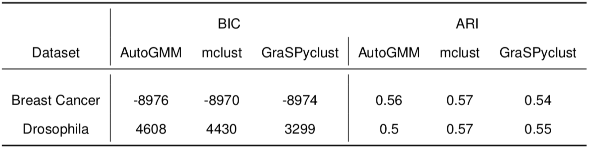

# Summary

Gaussian mixture modeling is a fundamental tool in clustering, as well
as discriminant analysis and semiparametric density estimation. However,
estimating the optimal model for any given number of components is an
NP-hard problem, and estimating the number of components is in some
respects an even harder problem. In R, a popular package called `mclust`
addresses both of these problems. However, Python has lacked such a
package. We therefore introduce `AutoGMM`, a Python algorithm for
automatic Gaussian mixture modeling, and its hierarchical version,
`HGMM`. `AutoGMM` builds upon `scikit-learn`’s `AgglomerativeClustering`
and `GaussianMixture` classes, with certain modifications to make the
results more stable. Empirically, on several different applications,
`AutoGMM` performs approximately as well as `mclust`, and sometimes
better. This package is freely available, and further shrinks the gap
between functionality of R and Python for data science.

# Statement of need 

Gaussian mixture modeling is a popular technique for clustering. In this
approach, a Gaussian mixture is fit to the observed data via maximum
likelihood estimation. The flexibility of the Gaussian mixture model,
however, comes at the cost hyperparameters that can be difficult to
tune, and model assumptions that can be difficult to choose [@jain]. If
users make assumptions about the model’s covariance matrices, they risk
inappropriate model restriction. On the other hand, relaxing covariance
assumptions leads to a large number of parameters to estimate. Users are
also forced to choose the number of mixture components and how to
initialize the estimation procedure.

This paper presents `AutoGMM`, a Gaussian mixture model based algorithm
implemented in python that automatically chooses the initialization,
number of clusters and covariance constraints. Inspired by the `mclust`
package in R [@mclust5], our algorithm iterates through different
clustering options and cluster numbers and evaluates each according to
the Bayesian Information Criterion. The algorithm starts with
agglomerative clustering, then fits a Gaussian mixture model with a
dynamic regularization scheme that discourages singleton clusters. We
compared the algorithm to `mclust` on several datasets, and they perform
similarly. `AutoGMM` (including `HGMM`) has a `scikit-learn` compliant API
and are freely available at <https://github.com/microsoft/graspologic>.

# Mathematics

`AutoGMM` performs an initial clustering (using k-means, agglomerative clustering, 
or random initialization), then fits a Gaussian mixture model using 
Expectation-Maximization. The algorithm sweeps through combinations of clustering 
options such as Gaussian covariance constraints and number of clusters. 
Each combination is evaluated with the Bayesian Information Criterion, 
defined as $2ln(\hat{L}) - p ln(n)$ where L is the maximized data likelihood, 
$p$ is the number of parameters, and $n$ is the number of data points [@bic].

The data likelihood in Expectation-Maximization of Gaussian mixture models 
can diverge if one of the Gaussians becomes concentrated around a single data point. 
When this occurs, `AutoGMM` reruns the clustering by adding a regularization factor 
to the diagonal of the covariance matrices. This ensures that the estimated covariances 
have positive eigenvalues, without affecting the eigenvectors. 

Built upon `AutoGMM`, a hierarchical version of this algorithm, `HGMM`, 
implements `AutoGMM` recursively on each cluster to identify potential subclusters. 
Specifically, `HGMM` estimates clusters from `AutoGMM` for the input data. 
For each of them, if the resulting number of clusters estimated by `AutoGMM` is 1, 
that cluster becomes a leaf cluster; otherwise, `HGMM` initiates a new level 
for this branch and passes data subsets associated with the estimated subclusters 
onto `AutoGMM`. The algorithm terminates when all clusters are leaf clusters.

# Performance
## Methods
We compare `AutoGMM` to two other clustering algorithms. The first,
`mclust v5.4.2`, is available on CRAN [@mclust5]. We use the package’s
`Mclust` function. The second, which we call `GraSPyclust`, uses the
`GaussianCluster` function in `graspologic`. 
The performance of those algorithms are evaluated on two datasets. 
For either dataset, the algorithms search over all of
their clustering options, and across all cluster numbers between 1 and 20. 
To compare clusterings, we calculate Adjusted Rand Index (ARI). The Rand Index is the
fraction of times that two clusterings agree whether a pair of points
are in the same cluster or different clusters. Adjusted Rand Index (ARI)
corrects for chance and takes values in the interval $[-1,1]$. If the
clusterings are identical, ARI is one, and if one of the clusterings is
random, then the expected value of ARI is zero.

The Wisconsin Breast Cancer Diagnostic Dataset contains data from 569
breast masses that were biopsied with fine needle aspiration. Each data
point includes 30 quantitative cytological features, and is labeled by
the clinical diagnosis of benign or malignant. The dataset is available
through the UCI Machine Learning Respository [@bc]. We include this
dataset because it was used in one of the original `mclust` publications
[@mclust_bc]. As in @mclust_bc, we only include the extreme area,
extreme smoothness, and mean texture features.

@drosophila analyzes a *Drosophila* connectome that was obtained via
electron microscopy [@drosophila_connectome]. As in @drosophila, we
cluster the first six dimensions of the right hemisphere’s adjacency
spectral embedding. The neuron types, Kenyon cells, input neurons,
output neurons, and projection neurons, are considered the true
clustering.

## Results
### AutoGMM

Table 1 shows the BIC and ARI values corresponding to the models 
that were chosen by each clustering algorithm on the complete datasets. 
The actual clusterings are shown in \autoref{fig:bc_cluster}-\autoref{fig:drosophila_cluster}. 
In the Wisconsin Breast Cancer dataset, the different algorithms chose
component numbers of three or four, when there were only 2 underlying
labels. All algorithms achieved similar BIC and ARI values. In the
*Drosophila* dataset, all algorithms left the mixture model covariances
completely unconstrained. Even though `AutoGMM` achieved the highest
BIC, it had the lowest ARI.

**Table 1**: BIC and ARI values of models chosen by different clustering methods. 
There are 2 in the Breast Cancer dataset, and 4 in the Drosophila dataset. 
BIC indicates how well the estimated GMM parameters fit the data (higher is better). 
ARI indicates how well the clustering agrees with the true clustering (higher is better).

In both the Wisconsin Breast Cancer dataset and the *Drosophila*
dataset, `AutoGMM` achieved ARI values between 0.5 and 0.6, which are
not particularly impressive. In the *Drosophila* data, most of the
disagreement between the `AutoGMM` clustering, and the neuron type
classification arises from the subdivision of the Kenyon cell type into
multiple subgroups (\autoref{fig:drosophila_cluster}). The authors of
@drosophila, who used `mclust`, also note this result.

![Clustering results of different algorithms on the breast cancer
dataset ([Wisconsin Breast Cancer Diagnostic Dataset][]). The original data was partitioned into two clusters (benign and malignant), but all algorithms here further
subdivided the data into three or four clusters.\label{fig:bc_cluster}](images/combined_bc_square.png){width="\textwidth"}

![Clustering results of different algorithms on the drosophila dataset
([Spectral Embedding of Larval *Drosophila* Mushroom Body Connectome][]). 
There is considerable variation in the different algorithms’ results. One similarity, however, is that all
algorithms subdivided the Kenyon cell cluster (red points in **(a)**)
into several clusters.\label{fig:drosophila_cluster}](images/combined_drosophila_square.png){width="\textwidth"}

### HGMM
To further illustrate the performance of `HGMM`, we studied its
application to the *Drosophila* dataset which was assumed to possess a
natural hierarchical structure of neuron types. For both hemispheres of
the connectome, we implemented `HGMM` with a maximum of six components
(the estimated number of clusters by `AutoGMM` shown before) on the
first six dimensions of the adjacency spectral embedding, and plotted
the dendrogram up to depth two. Notice that the depth-one clustering of
the right hemisphere by `HGMM` is the same as the estimation from
`AutoGMM` reported before (\autoref{fig:drosophila_cluster}b).
Recursively clustering at depth two results in fewer clusters of mixed
neuron types on both hemispheres (\autoref{fig:double_dendrograms}).
This suggests that `HGMM` could be useful for revealing neuron types and
subtypes on finer scales, paving way towards a better understanding of
how various scales of structural domains relate to activities.
